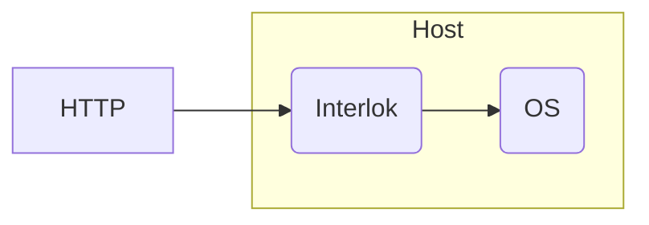

# Exec Testing

Project tests interlok-exec features

## What it does

This project contains a single Interlok instance that demonstrates executing scripts on the host operating system.

We have a single workflow that will trigger every five seconds creating a new file in the __failed_messages__ directory.  Then every thirty seconds a windows batch script will execute a __del__ of that directory.

 
## Getting started

* `./gradlew clean build`
* `(cd ./build/distribution && java -jar lib/interlok-boot.jar --failover bootstrap.properties)`

